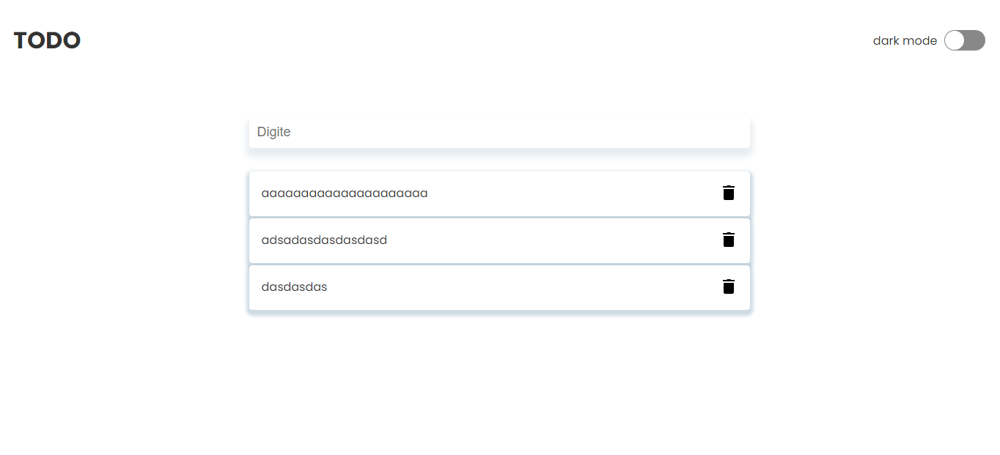

<h1 align="center">
  TODO
</h1>

<p align="center">
 

  
</p>

## 🚀 Tecnologias

Esse projeto foi desenvolvido com as seguintes tecnologias:

- React
- styled-components
- typescript
- NodeJS
- typeorm
- Express
- postgresql

</br>

### Como rodar o projeto

Antes de começar, você vai precisar ter instalado em sua máquina as seguintes ferramentas:
[Git](https://git-scm.com), [Node.js](https://nodejs.org/en/). 
Além disto é bom ter um editor para trabalhar com o código como [VSCode](https://code.visualstudio.com/)

### 🎲 Rodando o Back End (servidor)

```bash
# Clone este repositório
$ git clone <https://github.com/Maria-Eduarda90/todo>

# Acesse a pasta do projeto no terminal/cmd
$ cd todo

# Vá para a pasta server
$ cd back-end

# Instale as dependências
$ yarn install or npm install

# Execute a aplicação em modo de desenvolvimento
$ yarn dev or npm dev

# O servidor inciará na porta:3333 - acesse <http://localhost:3333>
```

</br>

<h1 align="center"> 
	🚧 Projeto 🚧
</h1>

<h1 align="center">
  
</h1>
<h1 align="center">
  
</h1>